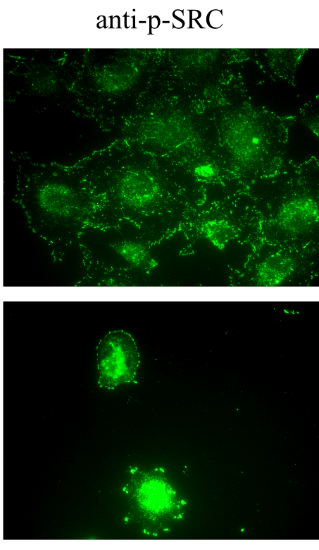

<!-- Limit image width and height -->
<style type="text/css">
img {     
  max-height: 480px;     
  max-width: 600px; 
  }
</style>

<style> .title-slide {
background-image:url(http://www.shalomlife.com/img/2012/04/16983/cancer_cells_2_/400_300_cancer_cells_2_.jpg);
background-repeat: no-repeat;
background-position: 0% -500%;
background-size: 100%;
background-color: #CBE7A5; /* ; ; */
}

.title-slide hgroup > h1{
 font-family: 'Oswald', 'Helvetica', sanserif; 
}

.title-slide hgroup > h1, 
.title-slide hgroup > h2 {
  color: #535E43 ;  /* ; #EF5150*/
}
</style>

<!-- Center image on slide -->
<script type="text/javascript" src="http://ajax.aspnetcdn.com/ajax/jQuery/jquery-1.7.min.js"></script>
<script type="text/javascript">
$(function() {     
  $("p:has(img)").addClass('centered'); 
});
</script>

<!-- Italic and Bold -->
<style>
em {
  font-style: italic
}
strong {
  font-weight: bold;
}
</style>

--- .segue .dark .nobackground
## Vähk kui haigus

--- 
## Vähk
- Mõiste vähk (tuumor, pahaloomuline kasvaja, neoplasm) tähistab suurt hulka erinevaid haiguseid (**NCI ~160 olulisemat**) mis võivad tekkida kõigis keha kudedes. 
- Vähi tunnuseks on **ebanormaalsete rakkude kasv väljapoole nende normaalseid koe piire**. Kõrvalolevate kudede invasioon ja levik teistesse organitesse ehk metastaseerumine.  
- Metastaasid on ka enamuse kasvajatest tingitud surmade põhjustajaks.

[A to Z List of Cancers](http://www.cancer.gov/cancertopics/types/alphalist)

---
# WHO andmetel
- Vähkkasvajad on maailmas üks juhtivatest surma põhjustatavatest haigustest, nõudes **8.2 miljonit elu 2012. a** (EU-27 osakaal 2012: 1.27 miljonit (15%))
- Kopsu-, maksa-, mao-, kolorektaal- ja rinnakasvajad põhjustavad enim 
vähisurmasid
- Sagedasemad vähitüübid on naistel ja meestel erinevad

---
## Vähi kolm peamist väljakutset maailmas

- ~30% vähisurmadest on tingitud viiest käitumis- ja dieediriskist: 
  - kõrge kehamassiindeks, 
  - vähe puu- ja aedvilju menüüs, 
  - vähene füüsiline aktiivsus, 
  - tubakas/suitsetamine, 
  - alkohol
- arengumaades põhjustavad 20% vähkidest hepatiidi viirused B ja C ning papilloomiviirused
- ennustatakse, et haigestumus suureneb maailmas 14 miljonilt 2012.a 22 miljonini 2030-ndatel

---

## Kõige sagedasemad surmaga lõppevad vähid maailmas, 2012 aasta seis:

- kops (1.59 miljonit surma)
- maks (745 000)
- magu (723 000 deaths)
- kolorektaal (694 000)
- rinnavähk (521 000)
- söögitoru (400 000)

---

## Erinevused 5-aasta elulemuses maailmas

```{r concord, echo=FALSE, warning=FALSE, message=FALSE, fig.align = 'center', cache=FALSE}
library(magrittr)
library(plyr);library(dplyr)

munge <- function(x) {
  sites <- c("Stomach","Colon","Rectum","Liver","Lung",
             "Breast","Cervix","Ovary","Prostate","Leukaemia","ALL")
  x %<>% "["(apply(.,2, function(y) !all(is.na(y))))
  colnames(x) <- c("Period",sites)
  newx <- x[!x$Period%in%"",]
  newx$Period %>% 
    as.character %>%
    .[grepl("[A-z]",.)] %>%
    rep(.,each = 4) %>%
    data.frame(Country=.,newx) %>% 
    .[!apply(., 1, function(x) x[1]==x[2]),] %>% {
      values <- "["(.,,3:ncol(.)) %>% 
        apply(.,2, .%>%as.character%>%as.numeric)
      "["(.,,1:2) %>% cbind(values)}
}

concord <- list.files(path = "data/concord-2/", pattern = ".csv", full.names = TRUE) %>%
  sapply(read.csv,header = FALSE) %>%
  lapply(munge) %>%
  ldply %>%
  mutate(Region=gsub("data/concord-2//([A-z-]+).csv","\\1",.id),
         Period=sub("([0-9-]+) ","\\1",Period)) %>%
  droplevels

library(reshape2)
library(ggplot2)
library(ggthemes)

concord %>% 
  melt %>% 
  ggplot(aes(x=Period,y=value)) +
  geom_line(aes(group=Country)) +
  geom_point(aes(group=Country)) +
  facet_grid(variable~Region,scales = "free_x") +
  scale_x_discrete(breaks=c("1995-99", "2000-04", "2005-09"),
                     labels=c("'95-'99", "'00-'04", "'05-'09")) +
  ylab(bquote(5-year~age-standardised~net~survival)) +
  xlab(bquote(Period~group("(",years,")"))) +
  theme(axis.text.x = element_text(angle=45,hjust=1,color="black"))+
  theme(axis.text=element_text(color="black"))
```

<footer class="source">Andmed: Global surveillance of cancer survival 1995-2009,                 25.7M patients, 67 countries (CONCORD-2). Allemani et. al
<a href="http://www.thelancet.com/journals/lancet/article/PIIS0140-6736%2814%2962038-9/abstract">2015</a>.
</footer>

---
## Kasvajatesse haigestumus Eestis

```{r haigestumus, echo=FALSE, warning=FALSE, message=FALSE, fig.align = 'center',cache=FALSE}
kasvajad <- read.csv("data/Kasvajad_haigestumus_2000-9.csv", header = TRUE)
# load libraries
# library(quantmod)
library(magrittr)
library(xts)
kasv <- melt(kasvajad, id = c("ICD10", "Organ", "Paikmed", "Sugu", "Aasta")) %>%
  filter(!variable == "Vanusrühmad.kokku",
         !Paikmed == "Kõik paikmed v.a. nahk (muu) (C00–C97 v.a.C44)",
         !Paikmed == "Kõik paikmed (C00-C97)")
kasv %>%
  group_by(Aasta,Sugu) %>%
  summarise(value = sum(value)) %>%
  ggplot(aes(x = as.factor(Aasta), y = value, fill = Sugu)) + 
  geom_bar(stat="identity") + 
  theme(axis.text.x  = element_text(angle=90, vjust=0.5)) +
  scale_y_continuous(name="Patsientide arv") +
  scale_x_discrete(name="Aasta") +
  theme(axis.text=element_text(color="black")) +
  scale_fill_colorblind()
```
<footer class="source">Andmed: TAI vähiregister
</footer>


---
## Sagedasemad paikmed Eestis

```{r sagedus, echo=FALSE, warning = FALSE, fig.height=8, fig.align = 'center'}
kasv %>% 
  group_by(Sugu, Paikmed) %>%
  summarise(value = sum(value)) %>%
  filter(value>100) %>%
  ggplot(aes(x = reorder(Paikmed, value), y = value, fill = Sugu)) + 
  geom_bar(stat="identity") + 
  scale_y_continuous(name="Patsientide arv 2000-2009") +
  scale_x_discrete(name="Paikmed") + 
  coord_flip() +
  theme(axis.text=element_text(color="black")) +
  scale_fill_colorblind()

```

<footer class="source">Andmed: TAI vähiregister
</footer>

---&twocol
## Vähitüübid

***=left

Kliiniliselt võib kasvajad jaotada kaheks

- **healoomulised** (lokaliseerunud, mitteinvasiivsed)
- **pahaloomulised** (invasiivsed, metastaatilised)

**Metastaasid** ehk vähi siirded vastutavad lõviosa kasvajatest tingitud surmade eest!

***=right


---
## Neli põhilist vähitüüpi

Epiteliaalsed | Mitte-epiteliaalsed
--------------|--------------------
kartsinoomid (*carcinoma*) | sarkoomid (*sarcoma*)
                           | hematopoieetilised
                           | neuroektodermaaltuumorid


- **Kartsinoomid vastutavad 80% vähisurmade eest**

--- .segue .dark .nobackground
## Vähiteke

---&twocol
## Vähiteke on pikajaline protsess

- USA andmete põhjal on 70 a. mehel 1000 korda kõrgem risk surra käärsoole vähki kui 10 a. poisil.
- Sporaadiline vähk on vana ea haigus ja sellest lähtuvalt võtab pahaloomulise vähi teke ilmselt aega kümneid aastaid.

***=left

```{r uk, echo=FALSE, fig.height=4.5}
uk <- read.csv("~/Dropbox/onkobioloogia/Tumorigenees/UKage") %>% 
  melt(.,id="Vanusegrupp") 
uk$Sugu<-"Naised"
uk$Sugu[grep("Meeste", uk$variable)]<-"Mehed" 
uk$variable <- gsub("^[MestNai.]{7}","",uk$variable)
ggplot(uk,aes(x=Vanusegrupp, y=value, fill=Sugu)) + 
  geom_bar(stat="identity", position="dodge") + 
  facet_wrap(~variable, scale="free_y") + 
  scale_fill_colorblind() +
theme(axis.text.x=element_text(angle=90,color="black")) + 
  ylab("") +
  ggtitle(paste(strwrap("Kõik vähid (C00-C97 välja arvatud C44). \nKeskmiselt uusi vähijuhtumeid aastas ja \nintsidents 100000 inimese kohta, UK, 2009-2011.", width = 50), collapse="\n"))  
```

***=right

```{r seer, echo=FALSE, fig.height=4.5,fig.width=4}
seer <- read.csv("~/Dropbox/onkobioloogia/Tumorigenees/SEER")
seer %>%  melt(id="Vanusegrupp") %>%
  ggplot(.,aes(x=Vanusegrupp, y=value, fill=variable)) + 
  geom_bar(stat="identity", position="dodge") + 
  scale_fill_colorblind() +
  scale_x_discrete(limits=rev(levels(seer$Vanusegrupp))) +
  theme(axis.text.x=element_text(angle=90,color="black")) +
  ggtitle(paste(strwrap("Vanus-korrigeeritud vähi intsidents, USA 2007-2011", width = 20), collapse="\n")) + xlab("")
```


<footer class="source"> Andmed: Vasakul, 
<a href="http://www.cancerresearchuk.org/cancer-info/cancerstats/incidence/age/">
Cancer Research UK
</a> ja paremal, 
<a href="http://seer.cancer.gov/csr/1975_2011/browse_csr.php?sectionSEL=2&pageSEL=sect_02_table.07.html#table1">
SEER Cancer Statistics Review 1975-2011.
</a>
</footer>

---&twocol
## Tee vähini võtab tavaliselt palju aega

- Soolevähi intsidents tõuseb tugevalt seitsmendal ja kaheksandal eludekaadil.
- Seega, iga samm või sündmus vähi suunas toimub kord **5 kuni 10 aasta** jooksul.
- Kogu protsess võtab aega 20 kuni 40 aastat.
- Siit nähtub, et **koos vanusega tekib meisse kõigisse paratamatult ka rakke, mis on juba läbinud mingi arvu (kuid mitte kõiki!) vähi tekkeni viivaid astmeid**.


```{r sool, echo=FALSE, fig.height=3,fig.width=3}
read.csv("~/Dropbox/onkobioloogia/Tumorigenees/eurorate") %>% 
  melt(.,id="Vanusegrupp") %>% filter(value>2&variable=="Sool") %>%
ggplot(., aes(x = Vanusegrupp, y = value) ) + geom_line(size=2) + xlim(0, 80) + 
  xlab("Vanus, aastates") + ylab("Surmasid 100000 inimese kohta") + ggtitle("Soolevähk")
```

---
## Osa vähke ei sõltu vanusest

- Inimse mesotelioomide (vasakul, tekib asbesti sisse hingamisel ja suitsetamisest) ja hiire nahavähi (benzo[*a*]püreeniga naha värvimisel) epidemioloogiline analüüs näitab, et **välised kantserogeenid on võimelised vähki indutseerima kindla ajakava alusel**.
- Ka kopsuvähi intsidents sõltub pigem suitsetamise staazist kui vanusest ja suitsetamise maha jätmisel risk enam ei suurene. 


<footer class="source"> Pilt:
<a href="http://www.nature.com/nature/journal/v411/n6835/full/411390a0.html">
Cancer epidemiology in the last century and the next decade.
</a>
</footer>

---&twocol
## Vähitekke pikaajalisus: suitsetamise mõju kopsuvähi levikule USA-s


***=left


***=right

- Kuni II maailmasõjani oli suitsetamine USA meeste seas vähelevinud.
- 30-35 aastat hiljem, 1970ndate aastate paiku, hakkas kopsuvähi intsidents järsult tõusma.
- Praegu on ülemaailmne kopsuvähi suremus ~1.39 miljonit aastas, tipp peaks saabuma 2020-30-ndtate aastate paiku.


<footer class="source"> Andmed:
<a href="http://www.nature.com/nrc/journal/v1/n1/full/nrc1001-082a.html">
Tobacco and the global lung cancer epidemic.
</a>
</footer>


---
## Mis tekitab vähki? Kartsinogeenid!

Kartsinogeenid toimivad mutageenidena ja nende toime-mehhanismiks on raku kasvukontrolli geenide muteerimine **onkogeenideks**.

$$\color{green}{normaalne\; kasvu kontrolli\; geen} \quad \underrightarrow{\times\; \color{red}{mutageen}} \quad \color{yellow}{onkogeen} $$


--- &twocol
## Keemilised kartsinogeenid

***=left


Katsusaburō Yamagiwa

***=right
- 1915. aastal demonstreeris **pigi** kartsinogeense toime
- pintseldas küüliku kõrvu igapäevaselt pigiga,
- mitu kuud hiljem moodustus lamerakuline kartsinoom.

**Näitas, et kasvajaid on võimalik esile kutsuda**


<footer class="source"> Pilt: http://the-rabbits-blog.blogspot.com/
</footer>

---
## Kartsinogeenid toimivad mutageenidena

<q>Füüsilise või keemilise katserogeeni poolt transformeerunud rakud kannavad muteerunud geene - *onkogeene* - , mis rikuvad normaalse kasvukontrolli.</q>

---.segue .dark .nobackground
## Onkogeenid

--- &twocol
## Tuumor-/onkoviiruste avastamine

*** =left
- 1908 aastal näitasid Taani teadlased Vilhelm Ellerman (1871-1924) ja Oluf Bang (1881-1937) et **lindude leukeemia** (*avian viral leukemia*) kandub viraalsel teel üle.

- 1909-11 aastatel katsetas Francis Peyton Rous (1879-1970) talle uurimiseks toodud **kana sarkoomiga** ja leidis samuti, et seda tuumorit on võimalik kanadel üle kanda vähi rakkudest sõltumatult.

*** =right


---- bg:lavender
## Onkoviirus on integreerinud oma genoomi rakulise onkogeeni


----
## Inimese kasvajatest leitud retroviraalsed onkogeenid, näited

Viirus | Liik | Onkogeen | Onkovalk | Inimese kasvaja
-------|------|----------|----------|----------------------------
Rousi sarkoom | kana | src | mitte-retseptor TK | käärsoole vähk
Abelsoni leukeemia | hiir | abl | mitte-retseptor TK | CML
Lindude erütroblastoos | hiir | erbB | retseptor TK | mao-, kopsu- ja rinnavähk
McDonough' kassi sarkoom | kass | fms | retseptor TK | AML
Hardy-Zuckerman kassi viirus | kass | kit | retseptor TK | GI strooma vähk
Hiire sarkoom 3611 | hiir | raf | Ser/Thr kinaas | kusepõie kartsinoom
*Simian sarcoma* | ahv | sis | kasvufaktor (PDGF) | erinevad vähid
Harvey' sarkoom | hiir/rott | H-ras | väike G-valk | kusepõie kartsinoom
Kirsten'i sarkoom | hiir/rott | K-ras | väike G-valk | erinevad vähid
Lindude erütroblastoos E26 | kana | ets | transkriptsioonifaktor | leukeemia
Lindude müelotsütoom | kana | myc | transkriptsioonifaktor | erinevad vähid
Retikuloendotelioos | kalkun | rel | transkriptsioonifaktor | lümfoom

--- 
## Inimese kasvaja-viirused

Viirus | Genoom | Kasvaja | Esmakirjeldus 
-------|--------|---------|---------------
Epstein-Barr viirus (EBV; *human herpesvirus 4*) | dsDNA herpesviirus | Burkitt'i lümfoom | 1964 
B-hepatiidi viirus (HBV) | ss/dsDNA hepadenoviirus | maksa kartsinoomid | 1965
inimese T-lümfotroopne viirus I (HTLV-I) | pluss-ahelaline ssRNA retroviirus | T-rakuline leukeemia | 1980
inimese papilloomiviirused (HPV) 16 ja -18 | dsDNA papilloomiviirus | emakakaela (*cervical*) vähk, peenisekasvajad, anogenitaal- ja  pea-kaela kasvajad | 1983-84
C-hepatiidi viirus (HCV) | pluss-ahelaline ssRNA flaviviirus | maksa kartsinoomid ja lümfoomid | 1989
Kaposi sarkoomi herpesviirus (KSHV; ; *human herpesvirus 8*) | dsDNA herpesviirus | Kaposi sarkoom, kehaõõne-lümfoom | 1994
Merkeli rakkude polüoomiviirus | dsDNA polüoomiviirus | Merkeli rakkude kartsinoom | 2008

---
## Kasvajates reeglina viiruspartikleid ei leita

- Inimese tuumoritest ei ole leitud lihtsaid retroviiruseid!
- Tuumorites on kirjeldatud klassikalisi viroloogi töövahendeid mikroskoopi ja viiruskultuuri kasutades EBV ja T-lümfotroopne viirus I, HTLV-I.
- B hepatiidi seos maksakartsinoomiga tehti kindlaks 22707 Taiwani meest hõlmavas populatsiooniuuringus.
- HPV-16/18, C hepatiidi, Kaposi sarkoomi ja Merkeli rakkude polüoomiviirus identifitseeriti kasvajates molekulaarbioloogia meetodeid kasutades.

---
## MYC 

- Üks esimesi onkogeene mis avastati peale src-i, lindude müelotsütoomi viirus  MC29-st
- Heterodimeerne transkriptsioonifaktor, peab dimeriseeruma teise bHLH TF-ga: 
      - ainult MYC:MAX heterodimeer seob DNA-le ja aktiveerib transkriptsiooni
- MAX seob MYC-perekonna valke: MYC, MYCN, MYCL
- MYC TF seostub *E-box* järjestusele *CACGTG*
- MYC vähid: Burkitti lümfoom, neuroblastoom
- Onkogeenseteks mutatsioonideks on transkriptsiooni üles-regulatsioon ja amplifikatsioon

--- &twocol
## N-MYC amplifikatsioon pärilikes neuroblastoomides

***=left

Kahte tüüpi amplifikatsioone

- HSR, homogeenselt värvuvad piirkonnad
- DM, *double minutes*: kromosoomi välised partiklid
- amplifikatsioonid on bimodaalsed 10-30 koopiat ja 100-150 koopiat
- lisaks neuroblastoomidele ka teistes neuroektodermaal kasvajates, astrotsütoomid, glioomid, ka väikse-rakulises kopsukasvajas.

***=right

# HSR ja *double minutes* (nooled)


---
## ERBB

- Kireldati algselt lindude erütroblastoosi tüvest R aastal 1935
    - R-tüvi sisaldas kahte rakulist onkogeeni erbA a erbB
        - erbA osutus hiljem mitte obligatoorseks hormoonretseptoriks
        - **erbB oli transformatsiooniks vajalik ja piisav**
- Membranne türosiin-kinaas, homoloogne EGF retseptoriga 
- Võrreldes EGFR-iga oli ErbB-l ekstratsellulaarne osa deleteerunud
    - selline deletsioonimutant ei seo ligandi (EGF), kuid on konstitutiivselt aktiivne
- inimesel glioblastoomides tavaline analoogne mutant **EGFRvIII**, kus on deleteerunud eksonid 2-7
- rinnakasvajates HER2/ERBB2/Neu lookuse amplifikatsioon 80% sagedusega *HER2-enriched* subtüübis

--- &twocol

## HER2 lookuse amplifikatsioon rinnakasvajates

***=left


***=right


--- &twocol

## SRC

***=left

- Huvitaval kombel SRC-i inimese kasvajatest eriti ei leitud
    - esineb ~12% kaugele arenenud käärsoole kartsinoomides *colorectal carcinoma*
- Src-perekonna kinaasid *Src family kinases (SFK)* on (Src, Fyn, Yes, Lck, Lyn, Hck, Fgr and Blk)
- Paradoksaalselt SRC näiteks rakkude jagunemist ei mõjuta, **toimib adhesioonides ja on seotud vähi invaseerumisega**.

***=right



---
## Onkogeenide aktivatsioonimehhanismid

- Regulatoorsed (protoonkogeeni amplifikatsioon, tuumorsupressorgeeni deletsioon)
- Struktuursed (mutatsioonid)
- Regulatoorsed $\times$ Struktuursed


---
## Mutatsioonid

Lisaks amplifikatsioonile ja üle-ekspressioonile on ka **mutatsioonid**

- H-ras mis isoleeriti inimese kusepõie kartsinoomist ei olnud amplifitseerunud,
- sekveneerimine näitas somaatilist G->T punktmutatsiooni, mis oli täiesti piisav et H-ras onkogeeniks muuta
- Vähides esinev mutatsioon koodonites 12 või 61 (G12V) muudab Ras-i konstitutiivselt aktiivseks, rikkudes GAP (*GTP-ase activating protein*) valgu seostumise


---
## Ras-i mutatsioonid
# Ras geenid on vähkides ühed sagedamini muteerunud geenidest (TCGA andmetel läbilõikes 10%)

Vähipaige/tüüp | % muteerunud RAS geeniga (homoloog)
---------|-------------------------
kõhunääre | 90 (K)
kilpnääre (papillaarne) | 60 (H,K,N)
kilpnääre (follikulaarne) | 55 (H,K,N)
käärsool | 45 (K)
seminoom | 45 (K,N)
müelodüsplaasia | 40 (N,K)
kops (mitte-väikserakuline) | 35 (K)
AML | 30 (N)
maks | 30 (N)
melanoom | 15 (K)
kusepõis | 10 (K)
neer | 10 (H)

---&twocol
## Ras valgud

***=left

- **Ras valgud toimivad GDP/GTP-sõltuvate lülititena.**
- Ras-GDP: inaktiivne/Ras-GTP: aktiivne.
- Normaalselt on rakkudes Ras seotud GDP-ga ja  mitteaktiivne.
- Rakuvälised stiimulid (nt. TGF-$\alpha$) põhjustavad transientse Ras-i aktivatsiooni.
    
***=right


---&twocol

## Mutantsed Ras valgud on GAP-tundetud

***=left

- **GDP$\leftrightarrow$GTP vahetust stimuleerivad GEF ja GAP valgud**
    - **GEF** (*guanine nucleotide exchange factor*): laadib Ras-i uue GTP-ga
    - **GAP** (*GTPase activating factor*): hüdrolüüsib GTP.
- Ras-i endogeenne GTP hüdrolüüs 100'000$\times$ madalama kiirusega GAP-vahendatud hüdrolüüsist!
- **Vähkides esinevad Ras mutatsioonid koodonites 12, 13 ja 61 rikuvad ära GAP-valkude seostumise.**

***=right


[April 2012 Molecule of the Month](http://www.rcsb.org/pdb/101/motm.do?momID=148&evtc=Suggest&evta=Moleculeof%20the%20Month&evtl=OtherOptions)

---
## SH2 grupid vahendavad Ras aktivatsiooni RTK-de poolt

- türosiinkinaas retseptor-P $\rightarrow$ SH2-Shc-P $\rightarrow$ SH2-Grb2-SH3 $\rightarrow$ proline-rich-Sos $\rightarrow$ Ras
- türosiinkinaas retseptor-P $\rightarrow$ SH2-Grb2-SH3 $\rightarrow$ proline-rich-Sos $\rightarrow$ Ras


--- &twocol

## Sagedamini amplifitseerunud genoomipiirkonnad

***=left


***=right

# Olulised korduvad fokaalsed koopiaarvu muutused (SCNA)

Top 10:

Geen | Funktsioon
-----|-----------
CCND1 | G1 tsükliin
EGFR | TK retseptor
MYC | transkripts. faktor
ERBB2 | TK retseptor
CCNE1 | G1 tsükliin
MCL1 | anti-apoptootiline valk
MDM2 | p53 E3 ubikvitiini ligaas


<footer class="source">Pan-cancer patterns of somatic copy number alteration. Travis I Zack,  Steven E Schumacher,  Scott L Carter,  Andrew D Cherniack,	Gordon Saksena,	Barbara Tabak,	Michael S Lawrence,	Cheng-Zhong Zhang,	Jeremiah Wala,	Craig H Mermel,	Carrie Sougnez,	Stacey B Gabriel,	Bryan Hernandez,	Hui Shen,	Peter W Laird,	Gad Getz,	Matthew Meyerson	& Rameen Beroukhim Nature Genetics 45, 1134–1140 (2013) doi:10.1038/ng.2760
</footer>

--- &twocol
## MYC translokatsioon

MYC aktivatsioon translokatsioonilise mehhanismi teel

***=left

- Burkitti lümfoomides
- c-myc geene translokeeritakse immunoglobuliini lookusesse kõigis BL.
- Immunoglobulin raske ahel IgH 80%,
$\kappa$ või $\lambda$ kerge ahel, kumbagi 10%.

Translokatsioon | Fuusion | Sagedus
----------------|--------|--------
t(8;14)(q24;q32)| IGH/MYC | 80%
t(2;8)(p12;q24) | IGK/MYC | 10%
t(8;22)(q24;q11) | IGL/MYC | 10 %

***=right


--- .segue .dark .nobackground
## Tuumorsupressorgeenid


---
## Tumorigenees

- Pahaloomulise vähi teke on pikaajaline protsess, mis tavaliselt võtab aega aastakümneid.
- Kasvaja progressioon põhineb rakkudes akumuleeruvatel juhuslikel geneetilistel või epigeneetilistel mutatsioonidel rakkude jagunemist ja ellujäämist reguleerivates geenides.
- Mutatsioonid, mis annavad tulevasele vähirakule selektiivse eelise nimetatakse juht- või draivermutatsioonideks (*driver*).


---
## Kasvaja klonaalsus: mono- või polüklonaalne

**Epigeneetika viitab monoklonaalsele päritolule**

R. Weinberg et. al analüüsisid leiomüoome, 1965. a 
- X-kromosoomi inaktivatsioon on juhuslik
- 30% Aafrika päritolu naistel on polümorfsm G6PD geenis (asub X-kromosoomis)
- heterosügootidel esines leiomüoomis ainult ühte geeni versiooni

---
## Kasvaja klonaalsus - müeloomid

- Müeloomid pärinevad B-rakkude eellastest, antikehi tootvatest plasmarakkudest
- Iga antikeha toodab üks kloon
- Igal patsiendil toodab müeloom vaid ühte antikeha

---
## Kasvaja evolutsioon: klonaalne ekspansioon

- **Vähi progressiooni iseloomustab geneetilise või epigeneetilise klooni ekspansioon**
- Kas see on juhuslik või omab selline kloon mingit selektiivset eelist?
- Klonaalne ekspansioon on sageli seotud p53 või p16 tuumorsupressor geeni kadumisega
- Vähi progressioon sisaldab järjestikuseid kloonide paljunemiseid.


<footer class="source"> Pilt: Barretti söögitoru (BE) areng kartsinoomiks sisaldab TP53 ja CDKN2A mutatsioone ning rekurentseid LOH-e (5q, 9p, 13q, 17p, 18q).
<a href="http://www.nature.com/ng/journal/v22/n1/full/ng0599_106.html">
Barrett et al., 1999.
</a>
</footer>
